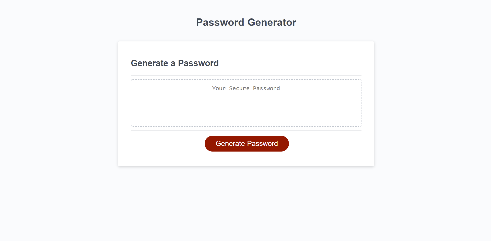

# Password Generator

## Description
This application, as the name suggests, is a password generator. 
When the button to generate a password is clicked, a series of prompts appear asking the user how long they want the
password to be and what types of characters can be included.
A random password is then generated that meets these criteria.

All passwords generated must be between 8 and 128 characters long. The types of characters that the user can select are
lowercase letters, uppercase letters, numbers, and special characters. The list of special characters that the password
generator uses can be found here: https://owasp.org/www-community/password-special-characters.

## Link to site
https://patricklquirk.github.io/password-generator/

## Image of site
